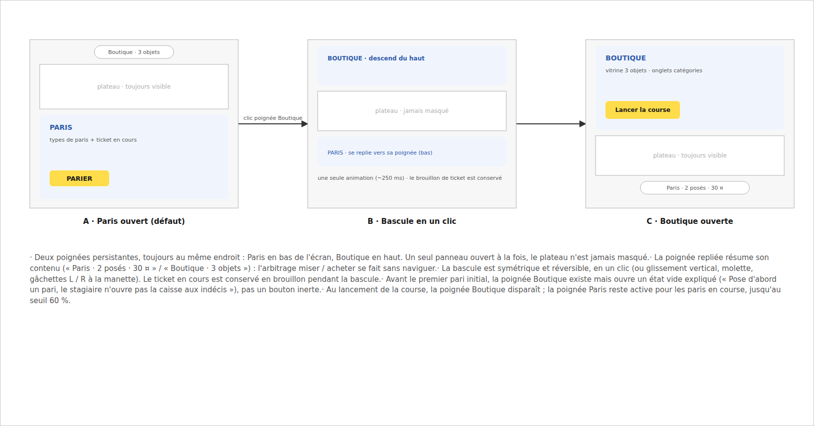

# 02 · Navigation Pari ↔ Boutique

## Objectif

Rendre l'aller-retour paris ↔ boutique gratuit : poignées persistantes qui résument leur contenu, plateau jamais masqué, brouillon de ticket conservé, et un état vide expliqué plutôt qu'un bouton inerte.

> **Décision d'adaptation** : la maquette place les panneaux en haut/bas (comme `interface.md`). Le proto les a mis **à gauche (boutique) et à droite (paris)**, ce qui préserve mieux la piste horizontale — on **garde l'axe gauche/droite du proto**. Les principes de la maquette (poignées résumées, plateau visible, brouillon, état vide) s'appliquent tels quels.

## État actuel (`GameScreen.tsx`)

- Drawer boutique à gauche (`drawer-left`), rendu seulement en phase `prep` ; l'onglet `tab-left` est **désactivé** tant qu'aucun pari initial n'est posé (tooltip « Pose d'abord un pari initial »), via `shopUnlocked`.
- Drawer paris à droite (`drawer-right`) ; onglet `tab-right` libellé `Paris ({n})`.
- Les deux drawers peuvent être ouverts en même temps (`bets-open` + `shop-open` sur `.table`).
- Le panneau de paris s'ouvre seul en préparation, se replie quand parier devient impossible, se rouvre sur `lateBetOpen` (Œil du parieur). La boutique se ferme dès que la course démarre.
- Le brouillon (type/âmes/mise sélectionnés dans `BetPanel`) survit déjà à l'ouverture/fermeture : le drawer reste monté. À préserver.

## Cible

Mêmes mécanismes, plus lisibles :

1. Les poignées repliées **résument leur contenu** pour permettre l'arbitrage sans naviguer.
2. La poignée Boutique est **toujours cliquable** en préparation ; sans pari posé, elle ouvre le panneau sur un état vide narratif.
3. Un seul geste pour passer de l'un à l'autre : les boutons croisés existants (« Boutique » dans le pied du BetPanel, « Retour aux paris » dans la boutique) restent, et se comportent en bascule.

## Changements

- **C1 (P2)** — Poignées résumées. Onglet paris : `Paris (2) · 30 ¤ misés` (somme des mises `open`) ; en course, s'il ne reste qu'à regarder : `Paris (2)`. Onglet boutique : `Boutique · {n} objets` (`ui.vitrine.length`). Libellés dans `texts.ts`.
- **C2 (P1)** — État vide de la boutique. Supprimer `disabled` sur `tab-left` : l'onglet ouvre toujours le drawer. Si `!shopUnlocked`, `ShopPanel` affiche à la place de la vitrine un état vide : « Pose d'abord un pari, le stagiaire n'ouvre pas la caisse aux indécis. » + bouton « Aller aux paris » (ouvre le drawer paris). Dès le premier pari posé, la vitrine apparaît sans re-clic si le panneau est ouvert.
- **C3 (P2)** — Bascule exclusive en écran étroit : sous ~1100 px de largeur de fenêtre, ouvrir un drawer ferme l'autre (les deux ouverts ne laissent plus assez de place au plateau). En large, comportement actuel conservé (les deux peuvent rester ouverts).
- **C4 (P3)** — Raccourcis clavier : `P` bascule le drawer paris, `B` la boutique (seulement en phase `prep` pour `B`), ignorés quand un champ a le focus. Documentés dans le `title` des onglets.

## Critères d'acceptation

- [ ] Panneau paris replié avec 2 paris de 10 et 20 : l'onglet affiche « Paris (2) · 30 ¤ misés ».
- [ ] Au tout début d'une course (aucun pari), cliquer l'onglet Boutique ouvre le drawer sur le message d'état vide ; poser un pari depuis le drawer paris fait apparaître la vitrine.
- [ ] Remplir un ticket (type + âme + mise) sans le poser, ouvrir la boutique, revenir : la saisie est intacte.
- [ ] Une fois la course lancée (`phase !== 'prep'`), plus aucun accès boutique (onglet absent) ; l'onglet Paris reste tant que la course n'est pas finie.
- [ ] À moins de 1100 px de large, ouvrir la boutique replie le panneau de paris (et réciproquement) ; le plateau reste entièrement visible.

## Hors périmètre

Déplacement des drawers vers haut/bas ; animation de « poignée qui aspire le panneau » ; gestes tactiles de glissement.
