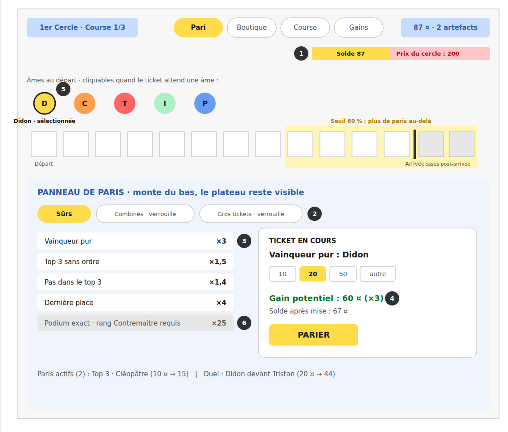

# 03 · Écran Paris (le ticket de guichet)

## Objectif

Supprimer tout calcul mental avant validation (gain potentiel + solde après mise), ancrer le choix de l'âme sur le plateau plutôt que dans une liste, et permettre de se rétracter tant que la course n'a pas commencé.

## État actuel (`BetPanel.tsx`, `core/rules/bets.ts`)

Déjà conforme à la cible (à conserver tel quel) :

- Trois paliers en onglets (`TIERS` : simple/intermédiaire/avancé) avec fourchette de cotes par palier ; types verrouillés visibles avec `🔒 {grade}` ; cote décotée en course (`currentMultiplier` + « Cotes décotées : course à {p} % ») ; mises en préréglages (`config.economy.stakes`) ; slots d'âmes ordonnés ou non selon le type ; ligne d'état du pied (manque, refus, résumé) avec **gain net** `+{net}` (`bp-gain`) ; raisons de refus explicites (`betRefusal`) ; chips d'âmes avec seuil (« chip-zone ») désactivées hors zone.

Écarts avec la cible :

- Le gain net est discret et le **solde après mise** n'apparaît nulle part.
- L'âme se choisit uniquement dans le panneau (chips) : le plateau n'est pas cliquable et rien ne s'y allume pendant la sélection.
- Un pari posé est définitif, même en préparation (aucune annulation).
- Le header n'a que le solde (jauge : voir 01/C1).

## Changements

- **C1 (P1)** — Bloc « ticket » dans le pied : quand le pari est prêt (`missing === 0 && !refusal`), la ligne d'état affiche sur deux lignes : `Gain potentiel : +{net} ¤ (×{mult})` (accent visuel, classe `good`) et `Solde après mise : {money - stake} ¤` (texte secondaire). Quand il n'est pas prêt, comportement actuel conservé.
- **C2 (P1)** — Sélection d'âmes sur le plateau. Quand le panneau de paris est ouvert et qu'il manque des âmes au ticket (`missing > 0`, phase où `open` est vrai) :
  - les jetons du plateau (`Board`, `.token`) et les entrées de légende deviennent cliquables : clic = `toggleSoul(id)` (mêmes règles que les chips : max `slots`, refus au-delà du seuil) ;
  - les jetons sélectionnés portent un anneau de la couleur du pari ; les jetons hors zone de pari sont marqués non sélectionnables (opacité + `title` « A dépassé le seuil de pari ») ;
  - survoler une chip d'âme dans le panneau allume le jeton correspondant sur le plateau, et réciproquement (réutiliser le mécanisme `activeSoul`/`legend-active` existant, via une prop `highlightSoul`).
  - Implémentation : remonter `souls`/`toggleSoul` de `BetPanel` vers `GameScreen` (état partagé), ou exposer un petit store de sélection ; au choix de l'agent, sans casser l'API de `BetPanel`.
- **C3 (P2)** — Annulation en préparation : dans `BetList`, chaque pari `open` affiche en phase `prep` un bouton « Retirer » qui rembourse intégralement la mise et supprime le pari. Dès que la course est lancée (`startRace`), plus d'annulation (l'engagement fait partie du jeu). Action noyau : `cancelBet(id)` dans `useRace`/`bets.ts` + test Vitest (remboursement exact, refus hors `prep`).
- **C4 (P2)** — Jauge des trois usages dans le header du panneau (01/C1), à côté du solde.
- **C5 (P3)** — Pictos de podium par type de pari : mini silhouettes (3 pleines = podium exact ; 2 pleines + 1 vide = deux dans le top 3…) devant le nom, en SVG inline, pour distinguer d'un coup d'œil les types proches. Ne pas le faire si ça surcharge la ligne : maquette = 1 ligne par type.

## Critères d'acceptation

- [ ] Ticket prêt (Vainqueur, Didon, mise 20, ×3) : le pied affiche « Gain potentiel : +40 ¤ (×3) » et « Solde après mise : {solde-20} ¤ », mis à jour à chaque changement de mise/type.
- [ ] Panneau ouvert, type « Duel » (2 âmes) : cliquer deux jetons sur le plateau remplit les deux slots dans l'ordre ; recliquer un jeton le retire ; un troisième clic sur une autre âme est ignoré.
- [ ] Une âme au-delà du seuil de 60 % n'est sélectionnable ni par chip ni par jeton, avec la même explication aux deux endroits.
- [ ] En préparation, « Retirer » sur un pari rend exactement la mise ; après « Lancer la course », le bouton n'existe plus.
- [ ] Test Vitest : `cancelBet` rembourse et supprime en `prep`, refuse ensuite.
- [ ] Aucune régression : verrouillage par rang, décote, refus (`betRefusal`) inchangés (`npm test`).

## Hors périmètre

Nouveau type de pari ; modification des cotes ou de la décote ; drag & drop de jetons ; fiche de personnalité au survol (les personnalités n'existent pas encore).
