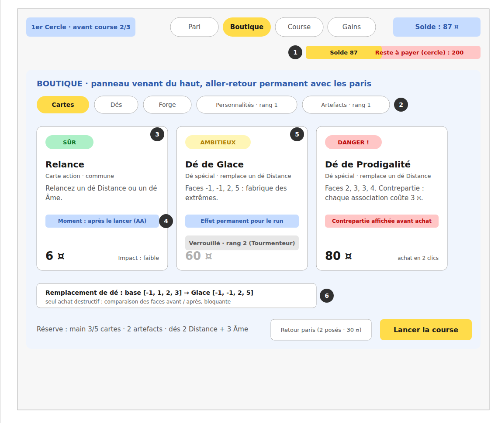

# 04 · Écran Boutique (la vitrine à trois tentations)

## Objectif

Faire de la vitrine une grammaire lisible en une visite : chaque objet annonce son niveau de risque (sûr / ambitieux / dangereux), son impact et sa contrepartie ; le coût d'opportunité (prix du cercle) reste sous les yeux ; les achats importants demandent une confirmation inline, pas une modale.

## État actuel (`ShopPanel.tsx`, `core/shop/*`, `config/shop.json`)

Déjà conforme (à conserver) :

- Carte-objet standardisée : type (`KIND_LABEL`), rareté, nom, description, aperçu des faces pour les dés (`FaceChip`), prix rouge quand trop cher (`shop-price-over`), carte lisible même inachetable.
- Flux de ciblage en deux temps pour dés et forge (`pending` → choix du dé / de la face, avec « Cible conseillée » et faces déjà forgées désactivées) : c'est la « comparaison bloquante » voulue pour le seul achat destructif. À garder tel quel.
- Renouvellement de la vitrine payant (`rerollCost`), inventaire replié sous la boutique, message d'erreur (`bet-refusal`).

Écarts :

- Rien n'exprime la **triade sûr / ambitieux / dangereux** ni l'**étiquette d'impact** (`boutique-README.md` § Échelle d'impact) : la rareté ne suffit pas, elle ne dit pas la contrepartie.
- Pas de reste-à-payer du cercle dans le header.
- Tout achat est en un clic, y compris les objets chers.
- Le remplacement de dé liste les faces du dé actuel mais ne met pas côte à côte **avant → après**.

## Changements

- **C1 (P2)** — Données : ajouter à chaque objet de `config/shop.json` deux champs optionnels : `impact` (`"faible" | "moyen" | "fort" | "extreme"`, défaut déduit de la rareté : common→faible, rare→moyen, legendary→fort) et `warning` (string : la contrepartie explicite, ex. « chaque association coûte 3 ¤ » pour le Dé de Prodigalité). Étendre le type `ShopItem` (`core/shop/items.ts`) et le chargement (`load.ts`) en conséquence.
- **C2 (P2)** — Rendu de la carte-objet : bandeau de tête à trois états — `SÛR` (vert) si pas de `warning` et impact ≤ moyen ; `AMBITIEUX` (ambre) si impact fort/extrême sans `warning` ; `DANGER ⚠` (rouge) si `warning` présent, avec la contrepartie affichée en rouge sous la description. Étiquette d'impact en pied de carte (« Impact : fort »). Trier la vitrine de gauche à droite du plus sûr au plus dangereux.
- **C3 (P2)** — Header : jauge des trois usages (01/C1) à côté du solde ; le sous-titre actuel (« Paris posés : ce qui reste est à dépenser… ou à garder. ») reste.
- **C4 (P2)** — Confirmation proportionnelle au prix : nouveau paramètre `shop.confirmThreshold` (défaut 60, `_comment` dans `shop.json`). Pour un objet dont le prix effectif (`priceFor`) ≥ seuil, ou marqué `warning`, le premier clic transforme le bouton en `Confirmer {price} ¤` pendant 3 s (retour à « Acheter » ensuite ou au clic ailleurs) ; le second clic achète. Jamais de modale. Les objets sous le seuil restent en un clic.
- **C5 (P2)** — Comparaison avant → après pour le remplacement de dé : dans le panneau `shop-target`, chaque option affiche les faces actuelles puis une flèche puis les faces du nouveau dé (`item.faces`), avec les `FaceChip` existants : `n°2 · Base  [-1][1][2][3] → [−1][−1][2][5]`.
- **C6 (P3)** — Vitrine vide : remplacer « Vitrine vide. » par un texte narratif (« Rien en rayon aujourd'hui. Le stagiaire hausse les épaules. ») via `texts.ts`.

> Note : le déblocage d'objets par rang du stagiaire (objets affichés verrouillés avec leur grade, comme les paris) arrivera avec les personnalités — **hors périmètre ici**, mais C2 doit laisser la place au `LockBadge` de 01/C3 dans la carte.

## Critères d'acceptation

- [ ] Le Dé de Prodigalité (si présent en vitrine) s'affiche `DANGER ⚠` avec sa contrepartie en rouge ; un artefact commun sans contrepartie s'affiche `SÛR` ; l'ordre gauche→droite va du plus sûr au plus dangereux.
- [ ] La jauge du header boutique est identique à celle du HUD et se met à jour immédiatement après un achat.
- [ ] Un objet à 80 ¤ (seuil 60) demande deux clics, le bouton affichant « Confirmer 80 ¤ » entre les deux ; un objet à 20 ¤ s'achète en un clic ; après 3 s sans second clic, le bouton redevient « Acheter ».
- [ ] Dans le flux de remplacement de dé, chaque option montre faces actuelles → nouvelles faces.
- [ ] Les objets trop chers restent entièrement lisibles (nom, description, faces) avec seulement le prix en rouge et le bouton désactivé.
- [ ] `npm test` : tests boutique existants verts ; nouveau test de chargement des champs `impact`/`warning` avec défauts.

## Hors périmètre

Onglets de catégories (la vitrine actuelle est trop petite pour en avoir besoin — à reconsidérer quand cartes et personnalités arriveront) ; déblocage par rang des objets ; moments de jeu des cartes (pas de cartes).
