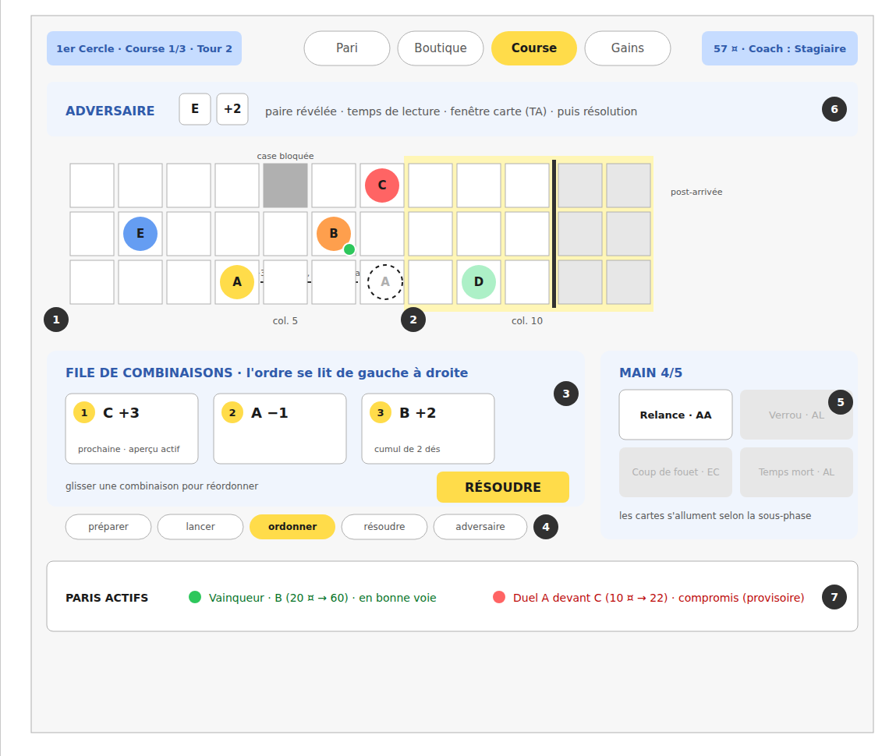
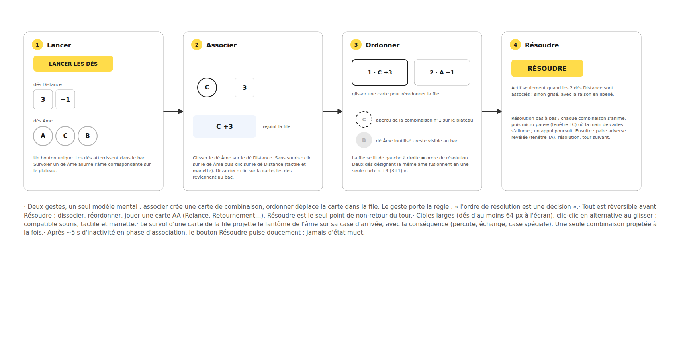

# 05 · Écran Course (association, file de combinaisons, prévisualisation)

## Objectif

Faire du séquencement des combinaisons une manipulation directe et réversible (le geste porte la règle « l'ordre de résolution est une décision »), et exploiter le déterminisme du jeu : montrer l'exact résultat du prochain déplacement avant de résoudre.

## État actuel (`PlaySlots.tsx`, `Board.tsx`, `useRace.ts`, `core/rules/race.ts`)

Déjà conforme (à conserver) :

- Association clic-clic : dé Âme puis dé Distance ; badges d'ordre `1·2·3` sur les dés appariés ; dé Âme inutilisé marqué `die-unused` ; liste `combos` avec note « cumulé avec la précédente » ; « Résoudre » actif seulement quand l'appariement est complet (`isPairingComplete`) ; « Réinitialiser » ; phrase d'aide contextuelle (`hint()`).
- HUD gauche : cercle, course, coach, et **terrain tiré** pour cette course (une des variantes du cercle).
- Plateau : couloir 0 en bas, cases bloquées hachurées `✕`, zone de pari teintée (`cell-betzone`), en-tête de colonnes avec « Départ / {seuil} % / Arrivée » et numéros, empilement sur case partagée, bulles d'événement (`↷` saut, `⇄` échange, `↕` détour, `✕` départ bloqué, `🏁`), légende avec positions, `activeSoul` en surbrillance pendant la résolution.
- Tour adverse : paire révélée dans `OpponentSlot` avant résolution.

Écarts :

- La liste `combos` est **en lecture seule** : impossible de retirer ou réordonner une combinaison sans tout réinitialiser.
- **Aucune prévisualisation** du déplacement à venir.
- La sous-phase n'est portée que par la phrase d'aide : pas de repère structurel stable.
- Rien ne s'allume sur le plateau au survol d'un dé Âme.

## Changements

- **C1 (P1)** — File de combinaisons manipulable (phase `pairing` uniquement) :
  - transformer `combos` en file de cartes interactives : chaque carte affiche `n° · {âme} {distance}` (repris de l'existant) plus deux contrôles au clavier/clic : `←`/`→` (échanger avec la voisine) et `×` (dissocier : la combinaison est retirée, ses dés redeviennent disponibles, les numéros d'ordre se recalculent) ;
  - actions correspondantes dans `useRace` : `removeCombination(index)`, `moveCombination(index, dir)` — pures sur le tableau `combinations`, aucun impact noyau ;
  - « Réinitialiser » reste (tout dissocier d'un coup) ;
  - glisser-déposer **natif** du navigateur (API HTML5, aucune bibliothèque) : un dé Âme se dépose sur un dé Distance pour associer, une carte se dépose sur une autre place de la file pour réordonner ; le clic-clic et les flèches restent l'alternative (tactile, manette, clavier) ; actions `pairDice(soulDie, distanceDie)` et `moveCombinationTo(from, to)` dans `useRace`.
- **C2 (P1)** — Prévisualisation du prochain déplacement :
  - noyau : `previewMove(race, soulId, distance): MoveResult` dans `core/rules/race.ts`, **pure** (clone l'état, réutilise la logique de déplacement existante, ne mute rien, ne touche pas au RNG). Tests Vitest : percute→saute (avec cascade), recul→échange, départ bloqué, détour de couloir, franchissement d'arrivée ;
  - présentation : en phase `pairing`, la **première combinaison de la file** est prévisualisée en continu sur le plateau ; survoler une autre carte de la file prévisualise celle-ci **seulement si elle est la première** non résolue (sinon `title` : « résolue après les précédentes ») ;
  - rendu : jeton fantôme (contour pointillé, semi-transparent, couleur de l'âme) sur la case d'arrivée calculée + réutilisation des glyphes de bulle existants pour la conséquence (`↷`, `⇄`, `↕`, `✕`, `🏁`) ; l'âme concernée s'allume comme pendant la résolution (`activeSoul`) ;
  - la prévisualisation disparaît dès `resolve()`.
- **C2 bis** — Prévisualisation de **toute** la file, et non plus de la seule première carte. Révise C2 ci-dessus et lève l'interdiction qui figurait en hors périmètre.
  - présentation : chaque carte de la file a son fantôme, dans l'ordre du joueur. Dès qu'il y en a deux, chaque fantôme porte son **numéro d'ordre** (`.ghost-n`) : deux fantômes côte à côte ne disent plus lequel se joue en premier, et l'ordre est précisément ce que le joueur règle. Le repère `.combo-preview` reste sur chaque carte prévisualisée, il relie la carte à son fantôme.
  - noyau : `previewQueue(ui)` (`presentation/useRace.ts`) remplace `previewNext`. Elle enchaîne `applyMove` sur l'état que laisse le déplacement précédent, exactement comme `resolveMoves`, déplacements induits compris (lien, aimant, souffle, tribune) — ceux-là avancent l'état sans recevoir de fantôme, n'étant issus d'aucune carte.
  - *raison du renversement* : la deuxième combinaison se joue sur un plateau déjà bougé par la première. La montrer sur le plateau d'avant, ou ne pas la montrer du tout, revenait à cacher au joueur l'effet de l'ordre qu'il est en train de choisir.
  - *limite assumée* : la Roue d'Ixion est appliquée par `resolveMoves`, pas par `applyMove` ; elle ne joue qu'une fois par cercle, sur un franchissement d'arrivée qui clôt la course. Elle n'est pas rejouée dans le fantôme.
- **C7** — Bulle de personnalité sur le jeton. Une âme qui porte un masque affiche au survol (et au focus clavier en mode sélection) une bulle dessinée : le signe, le nom de la personnalité, sa règle. Même dessin que la bulle des cases spéciales (`.cell-tip`), même règle de débordement — elle sort vers le haut, sauf sur le couloir du haut, et s'aligne sur le bord du jeton aux deux premières et deux dernières cases, où centrée elle sortirait du plateau.
  - *raison* : l'énoncé tenait dans le `title` du système, qui attend une seconde, ne se met pas en forme et tient sur une ligne. La personnalité est la première chose à lire avant de parier (GDD §1.3).
  - la légende sous le plateau garde l'énoncé complet en `aria-label` : c'est elle qui porte l'information pour qui ne voit pas la bulle.
- **C3 (P2)** — Frise de sous-phases : rangée de pastilles `préparer · lancer · ordonner · résoudre · adversaire` au-dessus des dés du joueur, l'étape courante en surbrillance (mapping : `prep`→préparer, `idle|rolling`→lancer, `pairing`→ordonner, `resolving`→résoudre, `opponent`→adversaire, `finished`→aucune). La phrase d'aide `hint()` reste (elle précise, la frise situe). Libellés dans `texts.ts`. La frise est conçue pour accueillir plus tard l'« allumage » des cartes actions par moment de jeu.
- **C4 (P2)** — Survol dé Âme ↔ plateau : survoler (ou focus clavier) un dé Âme lancé allume le jeton correspondant sur le plateau et son entrée de légende (prop `highlightSoul` sur `Board`, distincte d'`activeSoul` — même rendu, autre source). Fonctionne aussi pour les cartes de la file.
- **C5 (P2)** — Bouton qui pulse : en phase `pairing` avec appariement complet, si aucune interaction pendant `config.animation.idlePulseMs` (nouveau, défaut 5000, mis à l'échelle par la vitesse), « Résoudre » pulse doucement (animation CSS). Toute interaction réarme le délai. Jamais d'état muet.
- **C6 (P3)** — Départage montré : à l'établissement du classement, si deux âmes partagent une colonne, surligner brièvement la colonne entière (~1 s) — le texte du départage est dans la modale (06/C3).

## Critères d'acceptation

- [ ] Trois combinaisons formées : `×` sur la 2e la retire, ses dés redeviennent cliquables, les numéros deviennent 1·2 ; `→` sur la 1re l'échange avec la suivante ; tout est faisable au clavier (tab + entrée).
- [ ] Glisser un dé Âme sur un dé Distance forme la combinaison ; glisser une carte sur une autre place de la file la réordonne ; le clic-clic reste possible.
- [ ] Deux cartes visant la même âme : la première affiche le cumul « +4 (+3 +1) », la seconde « cumulé dans la carte n°1 ».
- [ ] File `[C +3, A −1]` avec une âme sur la case cible de C : le fantôme de C apparaît **devant** l'âme percutée (saut), avec le glyphe `↷` ; passer la combinaison `A −1` en tête change la prévisualisation.
- [ ] La prévisualisation coïncide toujours avec le déplacement réellement joué ensuite (mêmes règles) — vérifié par les tests de `previewMove` et un test croisé preview vs move effectif.
- [ ] `previewMove` ne modifie ni l'état de course ni la séquence RNG (deux appels successifs = même résultat ; résoudre après preview = résoudre sans preview).
- [ ] File de deux combinaisons : **deux** fantômes, numérotés 1 et 2, et le second est calculé sur la case où la première a posé son âme.
- [ ] Une âme masquée survolée montre sa bulle ; le classement de fin de course, lui, ne montre plus aucun masque.
- [ ] La frise indique « ordonner » pendant l'appariement et « adversaire » pendant la paire adverse.
- [ ] Survoler un dé Âme allume le bon jeton ; quitter le survol l'éteint.
- [ ] Après 5 s sans interaction avec appariement complet, « Résoudre » pulse ; cliquer un dé arrête le pulse.
- [ ] `npm test` vert, y compris les nouveaux tests noyau.

## Hors périmètre

Main de cartes et fenêtres EC/TA jouables (pas de cartes) ; modification du tour adverse.

*(La prévisualisation en chaîne de toute la file était ici, « interdite par la conception ». Elle ne l'est plus : voir C2 bis.)*
