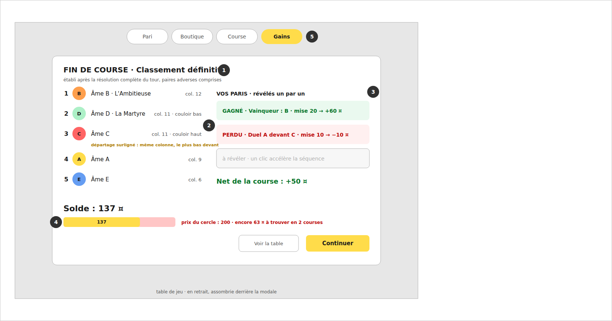

# 06 · Résultats et gains (fin de course)

## Objectif

Faire de la modale de fin de course le paiement émotionnel de la partie : d'abord la vérité de la course (le classement, départage montré), puis l'argent, ticket par ticket, avec le total qui s'incrémente — et toujours la réponse à « où en suis-je par rapport au prix du cercle ? ».

## État actuel (`Ranking.tsx`, `GameScreen.tsx`)

Déjà conforme (à conserver) :

- Modale au-dessus de la table après une respiration (`pauseMs × 2`), « Voir la table » la referme, onglet `Gains` la rouvre ; « Continuer » enchaîne.
- Classement complet avec rang, pastille couleur, case, couloir, n° d'arrivée ; podium stylé ; apparition en cascade (`animationDelay` 120 ms/ligne).
- Bilan des paris : liste won/lost avec net par pari, ligne « Gain net +X / Perte nette −X · argent : {money} ».

Écarts :

- Les paris apparaissent **tous d'un coup** : pas de révélation séquentielle ni de total qui s'incrémente.
- Le solde final n'est pas confronté au prix du cercle ni aux courses restantes.
- Le départage (« même colonne, le plus bas devant ») est appliqué mais jamais énoncé.
- Le sous-titre actuel (« Établi après la résolution complète du tour {turn} ») ne précise pas que la paire adverse est comprise.

## Changements

- **C1 (P1)** — Révélation séquentielle des paris :
  - le classement s'affiche d'abord (cascade actuelle), puis les tickets se révèlent un à un : chaque ticket apparaît toutes `config.animation.betRevealMs` (nouveau, défaut 500, mis à l'échelle par la vitesse), face « ? » ou masquée avant révélation ;
  - à chaque révélation : couleur (vert gagné / rouge perdu — déjà les classes `bet-won`/`bet-lost`), net du ticket, et **compteur de net de course** qui s'incrémente en pied (`Net de la course : +50 ¤`) ;
  - un clic n'importe où dans la modale révèle tout instantanément (skip) ; les boutons « Continuer / Voir la table » sont actifs pendant la séquence (agir = skip) ;
  - rouvrir la modale via l'onglet « Gains » ne rejoue pas la séquence : tout est révélé.
- **C2 (P1)** — Solde vs prix du cercle : sous le bilan, la jauge des trois usages (01/C1) avec `racesLeft` = courses restantes dans le cercle (calculable de `raceIndex` via `circleOf`) : « encore {missing} ¤ à trouver en {racesLeft} course(s) » en avertissement, ou « prix du cercle couvert » sinon. Après la 3e course, le paiement du prix est géré par `App.tsx` (dialogues) — la jauge de la modale montre l'état **avant** paiement.
- **C3 (P2)** — Départage montré : quand deux âmes classées consécutivement partagent la même colonne (`position` égale), une ligne fine sous la paire : « départage : même colonne, le couloir le plus bas devant ». Une seule fois par paire concernée.
- **C4 (P3)** — Sous-titre précisé : « Établi après la résolution complète du tour {turn}, paire adverse comprise. » (`texts.ts`).

## Critères d'acceptation

- [ ] Course avec 3 paris : la modale montre le classement, puis les tickets se révèlent à ~0,5 s d'intervalle (×1) avec le compteur de net qui progresse ; un clic révèle tout ; « Gains » après fermeture rouvre tout révélé, sans rejouer.
- [ ] La vitesse ×4 accélère la séquence d'autant.
- [ ] Solde 137, prix 200, après la 1re course du cercle : la jauge affiche l'avertissement « encore 63 ¤ à trouver en 2 courses ».
- [ ] Deux âmes en colonne 11 (couloirs différents) : la ligne de départage apparaît entre leurs deux rangs, et nulle part ailleurs.
- [ ] Aucun changement du calcul de règlement (`core/rules/bets.ts` non modifié pour C1–C4) ; `npm test` vert.

## Hors périmètre

Statistiques de course dans la modale (collisions, historique) ; récompenses de boss ; écrans de transition de cercle (gérés par `App.tsx`/`Dialogue`).
