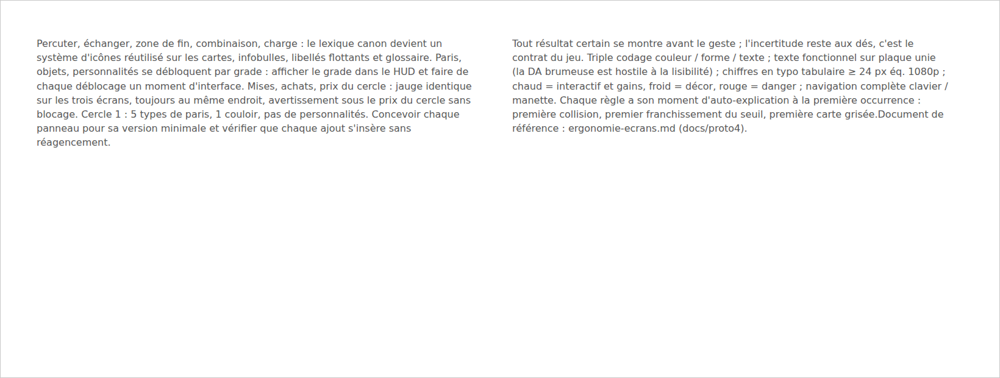

# Specs UI — intégration des écrans ergonomiques dans le proto

> Public : agent Claude Code travaillant dans `Proto4Html/`.
> Objet : intégrer dans le prototype existant (fonctionnel) les écrans conçus lors de la passe d'ergonomie.
> Références amont : `../ergonomie-ecrans.md` (recommandations complètes), maquettes Miro (captures dans `./img/`), `../GDD.md`, `../interface.md`.

## Comment lire ces specs

Le proto implémente déjà une grande partie des recommandations (paliers de paris, cotes décotées, verrouillage par rang, modale de résultats, sélection de cible en forge…). Ces specs sont donc écrites en **delta** : chaque fichier décrit l'état actuel (avec les fichiers concernés), la cible, puis une liste de changements numérotés `C1, C2…` avec priorité, et des critères d'acceptation. Ne pas réécrire ce qui marche : modifier au plus près de l'existant.

| Fichier | Sujet | Composants concernés |
|---|---|---|
| [`01-composants-transverses.md`](01-composants-transverses.md) | Jauge des trois usages, états verrouillés, vocabulaire, accessibilité | nouveau `MoneyGauge`, `GameScreen`, `texts.ts` |
| [`02-navigation-pari-boutique.md`](02-navigation-pari-boutique.md) | Poignées résumées, état vide de la boutique, brouillon conservé | `GameScreen.tsx` |
| [`03-ecran-paris.md`](03-ecran-paris.md) | Ticket de pari : gain/solde en direct, sélection d'âmes sur le plateau, annulation | `BetPanel.tsx`, `Board.tsx` |
| [`04-ecran-boutique.md`](04-ecran-boutique.md) | Étiquettes d'impact, triade sûr/ambitieux/dangereux, confirmation proportionnelle | `ShopPanel.tsx`, `core/shop/*`, `config/shop.json` |
| [`05-ecran-course.md`](05-ecran-course.md) | File de combinaisons manipulable, prévisualisation fantôme, frise de sous-phases | `PlaySlots.tsx`, `Board.tsx`, `useRace.ts`, `core/rules/race.ts` |
| [`06-resultats-gains.md`](06-resultats-gains.md) | Révélation séquentielle des tickets, solde vs prix du cercle, départage montré | `Ranking.tsx` |
| [`07-tests-e2e-playwright.md`](07-tests-e2e-playwright.md) | Scénarios E2E Playwright vérifiant les critères d'ergonomie et de lisibilité | nouveau dossier `e2e/`, `playwright.config.ts` |
| [`08-corrections-post-test.md`](08-corrections-post-test.md) | Tickets priorisés issus du run joué : espace (HUD, panneaux haut/bas), fusion du cumul, feedback des paris | `GameScreen.tsx`, `BetPanel.tsx`, `PlaySlots.tsx`, `index.css` |

## Priorités

- **P1** (cœur de la passe d'ergonomie) : jauge des trois usages (01/C1), prévisualisation du prochain déplacement (05/C2), file de combinaisons manipulable (05/C1), révélation séquentielle des gains (06/C1), état vide de la boutique (02/C2).
- **P2** : le reste, dans l'ordre des fichiers. Les tests E2E (07) s'écrivent au fil des changements qu'ils couvrent, pas à la fin.
- **P3** : marqué explicitement, à ne faire que si le coût est faible.

## Contraintes globales

1. **Aucune dépendance nouvelle au runtime** : React seul, comme aujourd'hui (`package.json`). Pas de lib de drag & drop : le glisser-déposer utilise l'API native du navigateur, avec le clic/clavier en alternative (voir 05). L'outillage de test (`@playwright/test`, spec 07) est une devDependency.
2. **Le noyau reste pur** : tout ce qui touche `src/core/**` reste sans React ni DOM, testé par Vitest (`npm test`). La prévisualisation (05/C2) est une fonction pure du noyau.
3. **Configurable** : toute nouvelle valeur (seuil de confirmation d'achat, durée de révélation d'un ticket, délai de pulse) vit dans `config/race.json` ou `config/shop.json` avec un `_comment`, jamais en dur (GDD §9.1).
4. **Vitesse d'animation** : toute nouvelle animation respecte l'option vitesse ×0,5 à ×4 (`options.speed`), comme `stepMs`/`pauseMs` aujourd'hui.
5. **Textes** : tout libellé nouveau passe par `src/presentation/texts.ts`, en français, en réutilisant le vocabulaire canon (percuter, échanger, zone de fin, combinaison — cf. `../boutique-README.md` § Vocabulaire commun).
6. **Accessibilité** : ne jamais coder une information uniquement par la couleur (doubler d'un texte ou d'une forme) ; conserver les `aria-label` existants ; les nouveaux boutons sont de vrais `<button>` accessibles au clavier.
7. **Définition of done par changement** : `npm run typecheck` et `npm test` passent ; le changement est visible en jeu au cercle 1 sans menu dev ; les critères d'acceptation du fichier sont vérifiés à la main.

## Ce qui est explicitement hors périmètre

Cartes actions, personnalités d'âmes, pouvoirs de boss appliqués en course, refonte de la direction artistique, sons. Les specs préparent parfois leur place (ex. frise de sous-phases pensée pour accueillir les moments de jeu AA/EC/TA), sans les implémenter.

## Vue d'ensemble des maquettes

Les captures ci-dessous viennent du board Miro (maquettes annotées). Elles montrent l'intention d'ergonomie, pas la direction artistique : le proto garde son habillage actuel.

